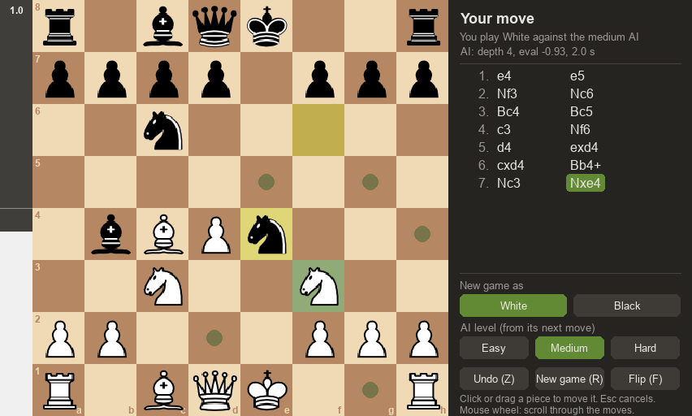
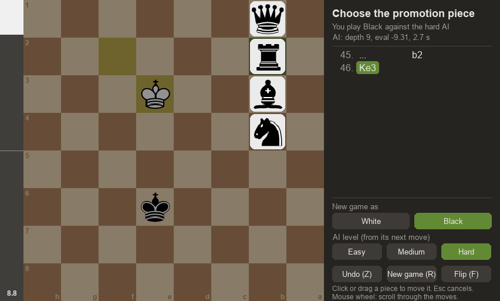
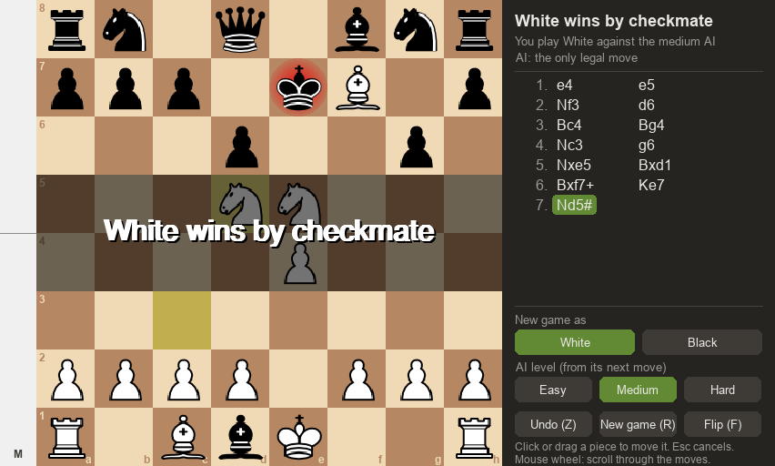
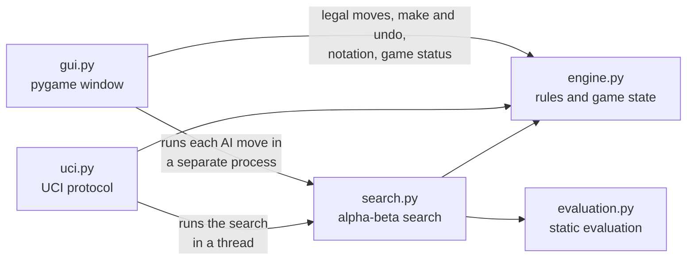

# Chess Engine AI

[](https://github.com/keshavm21/Chess-Engine-AI/actions/workflows/tests.yml)


A chess program written in pure Python: a complete rules engine, an AI that searches with alpha-beta pruning, a quiescence search and a transposition table, and a pygame interface to play against it. The engine also speaks the UCI protocol, so standard chess programs can use it.



## Features

**Playing**
- Play White or Black against three AI levels (easy, medium, hard). When you play Black, the board turns around and the AI opens.
- Move by clicking a piece and then a square, or by dragging. Legal moves, the last move and a king in check are highlighted.
- Choose the promotion piece: queen, rook, bishop or knight.
- A move list in standard algebraic notation (`Nbd7`, `O-O-O`, `e8=N`, `Qh7#`) that scrolls with the mouse wheel.
- A status line showing whose turn it is and how the AI found its last move: search depth, evaluation and thinking time.
- An evaluation bar driven by the engine's own evaluation.
- Undo (it also takes back the AI's reply), new game and board flip.

**Engine and AI**
- All the rules: castling, en passant, promotion to any piece, checkmate, stalemate, and draws by threefold repetition, the fifty-move rule and insufficient material. Move generation is checked with perft counts on standard test positions.
- Negamax search with alpha-beta pruning and iterative deepening under a time limit.
- A quiescence search that plays out captures, so positions aren't judged in the middle of an exchange.
- A transposition table (Zobrist hashing) and move ordering with the hash move, MVV-LVA captures, killer moves and the history heuristic.
- A hand-written evaluation: material, piece-square tables blended between middlegame and endgame, pawn structure, bishop pair, rooks on open files and king safety.
- A UCI mode (`python -m chess_ai.uci`) for chess GUIs such as Arena or Cute Chess.

## Quick start

You need Python 3.10–3.13 (pygame has no pre-built packages for 3.14 yet). Check what you have with `python3.12 --version` (or `python3 --version`). On macOS, the built-in `python3` is 3.9, which is too old; install a newer Python with `brew install python@3.12` or from [python.org](https://www.python.org/downloads/).

```bash
git clone https://github.com/keshavm21/Chess-Engine-AI.git
cd Chess-Engine-AI
python3.12 -m venv venv           # any of 3.10–3.13; Windows: py -3.12 -m venv venv
source venv/bin/activate          # Windows: venv\Scripts\activate
pip install -r requirements.txt
python -m chess_ai
```

## How to play

| Action | How |
|---|---|
| Move a piece | Click it, then click the target square, or drag it there |
| Promote a pawn | Move it to the last rank, then click the piece you want |
| Play the other colour | Click **White** or **Black** under "New game as" |
| Change the AI level | Click **Easy**, **Medium** or **Hard** (used from the AI's next move) |
| Undo | **Z** or the **Undo** button: takes back your move and the AI's reply |
| New game | **R** or the **New game** button: same side and level |
| Flip the board | **F** or the **Flip** button |
| Cancel a half-made move | **Esc**, or click elsewhere |
| Scroll the move list | Mouse wheel |

The levels differ in thinking time: easy 0.5 s per move (at most 2 half-moves deep), medium 2 s (the default), hard 5 s.

<table>
  <tr>
    <td></td>
    <td></td>
  </tr>
  <tr>
    <td>Playing Black (the board is turned around) and choosing the promotion piece</td>
    <td>The end of a game, with the move list in standard notation</td>
  </tr>
</table>

## Using the engine in other chess programs (UCI)

```bash
python -m chess_ai.uci
```

This speaks the [Universal Chess Interface](https://www.chessprogramming.org/UCI) on standard input and output. To add the engine to a GUI, use the virtual environment's Python as the command, `-m chess_ai.uci` as the arguments and the repository folder as the working directory. A real session (`>` is sent to the engine, `<` is its answer):

```text
> uci
< id name Chess-Engine-AI 1.0.0
< id author Keshav Mishra
< uciok
> isready
< readyok
> position startpos moves e2e4 e7e5
> go movetime 1000
< info depth 4 score cp 10 nodes 17581 nps 18503 time 950 pv b1c3
< bestmove b1c3
```

Supported: `uci`, `isready`, `ucinewgame`, `position` (`startpos` or `fen`, with `moves`), `go` with `wtime`/`btime`/`winc`/`binc`/`movestogo`, `movetime`, `depth` or `infinite`, `stop` and `quit`. The search runs in a background thread, so `stop` and `isready` are answered while the engine thinks. With a clock, each move gets an even share of the remaining time (as if 30 moves were left) plus most of the increment, and never more than half of what is left.

## How it works

### Architecture



| Module | Responsibility |
|---|---|
| `engine.py` | `GameState`: the board, legal move generation, make and undo, FEN, standard notation (SAN), Zobrist keys, game status and draw rules |
| `search.py` | `Searcher`: iterative deepening, alpha-beta, quiescence search, transposition table, move ordering and the difficulty presets |
| `evaluation.py` | `evaluate(gs)`: a score in centipawns, a pure function of the board and the side to move |
| `gui.py` | The pygame window: an `App` with one state at a time (your turn, choosing a promotion, AI thinking, animating, game over) |
| `uci.py` | The UCI front end |

The search never touches the interface. The window runs each AI move in a separate process, so it stays responsive while the AI thinks, and it stops that process when you undo, start a new game or close the window.

### Board and rules

The board is an 8×8 list of two-character strings (`"wK"`, `"bp"`, `"--"` for empty). Legal moves are generated as pseudo-legal moves and filtered by checking whether the king would be attacked. That check scans outward from the king's square with precomputed knight, king and ray tables, rather than generating the opponent's moves. `make_move` and `undo_move` keep logs of castling rights, en-passant squares, move counters and Zobrist keys, so any position can be restored exactly. Repetitions are found by comparing Zobrist keys back to the last capture or pawn move.

### Search

- **Negamax with alpha-beta pruning**: minimax written once for both sides; branches that cannot change the result are cut off.
- **Iterative deepening under a time limit**: depths 1, 2, 3, … are searched in turn, and the best move of the deepest *completed* depth is played. Depth 1 always completes. A new depth isn't started once half the time is used, because it could not finish.
- **Quiescence search**: at the end of the main search, captures and queen promotions are played out until the position is quiet. Captures are tried best first (most valuable victim, least valuable attacker). Captures that cannot matter are skipped: delta pruning, plus defended pieces taken by a much more valuable piece.
- **Transposition table**: results are stored by Zobrist key with their depth and bound. Mate scores count the moves to the mate (so the engine prefers the fastest one), and the table stores them relative to the position, so they stay right wherever it is reached again.
- **Move ordering**: the stored best move first, then captures, then two "killer" moves per ply (quiet moves that caused a cutoff at that ply before), then the other quiet moves by a history score.
- **Draws**: inside the search, any repetition, the fifty-move rule and insufficient material score as a draw, so a losing side steers into a draw and a winning side avoids one.

### Evaluation

Scores are in centipawns (100 = one pawn) from White's point of view:

| Term | Values |
|---|---|
| Material | pawn 100, knight 320, bishop 330, rook 500, queen 900 |
| Piece-square tables | Generated from simple rules (e.g. knights and bishops toward the centre, pawns forward, the king sheltered in the middlegame and central in the endgame), blended by how much material is left |
| Pawn structure | Doubled −15, isolated −15, passed +5 to +100 by rank (half as much in the middlegame) |
| Pieces | Bishop pair +30, rook on an open file +20, half-open file +10 |
| King safety | Pawns in front of the king +10 / +5 (middlegame only) |
| Side to move | +10 |

The evaluation is colour-symmetric: the tests check that mirroring a position negates its score.

## Strength and speed

Measured with `python -m chess_ai.benchmark` on an Apple M1 (macOS) with Python 3.12.14. The history of every change, with its environment, is in [docs/benchmarks.md](docs/benchmarks.md).

| Position | Depth 3: time / positions searched | Depth reached in 1 s | Move |
|---|---|---|---|
| Starting position | 0.05 s / 1 186 | 4 | b1c3 |
| Italian Game | 0.15 s / 2 678 | 3 | g8f6 |
| Middlegame | 0.28 s / 4 715 | 4 | d4c6 |
| Kiwipete (a stress-test position) | 1.33 s / 24 842 | 2 | e2a6 |

The search visits about 18 000 positions per second, and move generation alone about 390 000–440 000 (perft). At the default 2 s per move the engine reaches depth 4 or more in 19 of 20 test positions, with the quiescence search on top.

**Compared with the original program** (same machine, same four positions at depth 3):

| | Original | v1.0 |
|---|---|---|
| Time for the four searches | 120.2 s (Python 3.9) | 1.8 s (Python 3.12), with a quiescence search on top |
| Positions per second | 81 | about 18 400 |

About 2.7× of that came from moving to Python 3.12. Most of the rest came from detecting attacks directly instead of generating the opponent's moves, and from a much cheaper evaluation.

**Playing strength**, measured with tools in this repository:
- **Tactics suite:** 22 puzzles (mate in 1–3, winning material, avoiding blunders) whose answers were verified by exhaustive search. Solved: **22/22** at 2 s per move (`python -m chess_ai.tactics`).
- **Self-play matches** (`python -m chess_ai.match`), 20 games each at 0.3 s per move:
  - the version with quiescence search and the new evaluation beat the previous version **+17 =3 −0**;
  - adding the transposition table and move ordering then scored **+11 =3 −6**.

The engine has not been rated against other engines. The UCI mode makes that possible.

## Testing

```bash
pip install -r requirements-dev.txt
pytest                    # the full suite (420 tests, about a minute)
pytest -m "not slow"      # the quicker part, about 20 seconds
ruff check . && ruff format --check .
```

The tests cover:
- **Rules:** perft counts on five standard positions; exact state restoration after every make and undo; attack detection against an independent reference; FEN, notation, promotion and draw rules; Zobrist keys.
- **Search:** mate distances, the time limit, the transposition table, quiescence and move ordering, and the tactics answers.
- **Interface and UCI:** the game window, driven headlessly through complete scripted games; the UCI mode, including a real engine process talking over pipes.

GitHub Actions runs the linter, the formatter check and the full suite on Python 3.10, 3.11, 3.12 and 3.13 for every push.

Tools for measuring changes:

```bash
python -m chess_ai.benchmark            # perft and search speed; --json PATH to save results
python -m chess_ai.tactics              # tactics suite at 2 s per move; --depth N for a fixed depth
python -m chess_ai.match default no-quiescence --jobs 4   # self-play match between two configurations
```

## Project structure

```text
chess_ai/
├── __main__.py      python -m chess_ai: opens the game window
├── gui.py           pygame interface
├── engine.py        rules and game state
├── search.py        search
├── evaluation.py    static evaluation
├── uci.py           UCI mode
├── benchmark.py     perft and search benchmark
├── tactics.py       tactics suite with verified answers
├── match.py         self-play matches between engine configurations
└── assets/pieces/   piece images
tests/               pytest suite
docs/
├── benchmarks.md    measurements for every change, with environment
├── improvement-plan/  how the project was improved, phase by phase
└── images/          screenshots
```

## How the project was developed

The project was improved in planned phases, each ending with a working game. The phases were:
- tests and CI first;
- a package structure with consistent naming;
- rule and search fixes (for example underpromotion, and an engine that could miss a mate in one);
- a faster move generator;
- iterative deepening with a time limit;
- quiescence search and a new evaluation;
- hashing, draw rules and a transposition table;
- the interface;
- release polish.

[docs/improvement-plan/](docs/improvement-plan/README.md) records the findings, the plan and the measured outcome of every phase.

## Known limitations

- **Pure Python is slow for chess.** At about 18 000 positions per second the engine looks 4–5 half-moves ahead (plus captures) in 2 seconds; strong engines search millions of positions per second.
- **No opening book or endgame tablebases.** The evaluation is deliberately small and hand-written.
- **The transposition table isn't kept between moves.** The game window starts a new search process for every AI move, and the UCI mode starts a new search for every `go`.
- **The UCI mode is minimal:** no options, no pondering, one line of analysis, and `go nodes` / `go mate` are not supported.
- **Platforms:** developed on macOS; the tests also run on Linux (Ubuntu) in CI. Windows is untested.

## Credits

The project began by following Eddie Sharick's *Chess Engine in Python* YouTube series, which gave it its original shape: the pygame board, move generation with make and undo, and a first minimax AI. The search, evaluation, interface, tests and tooling have since been rewritten or added.

The piece images in `chess_ai/assets/pieces/` come from that series' files.

## License

The code is released under the [MIT License](LICENSE). The piece images are not covered by it (see Credits).
